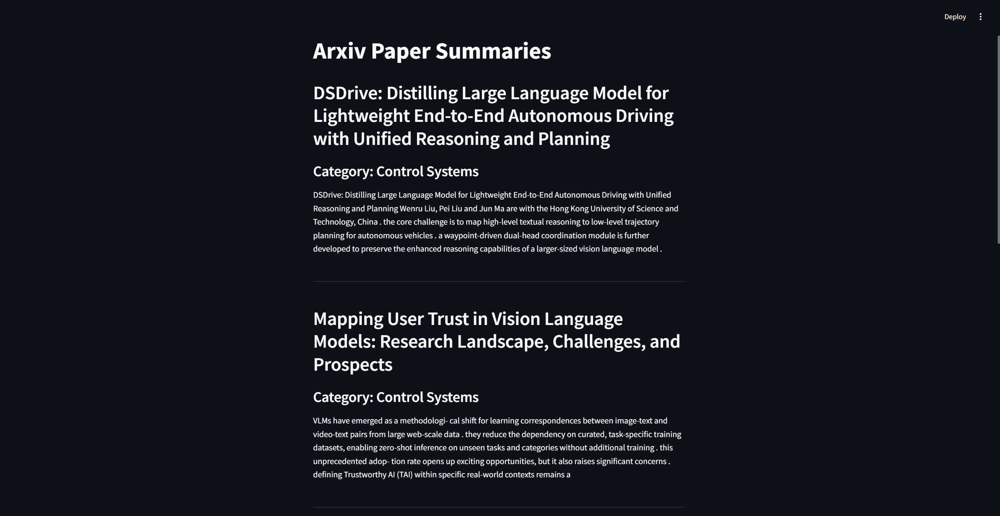

# ResearchDigest

**Disclaimer**: This is a proof-of-concept implementation of a custom arXiv paper fetcher. It is not production-ready and has limitations.

---

## Overview

**ResearchDigest** is a Streamlit-based application that allows users to:

- Fetch recent papers from arXiv (default category: `cs.RO` - Robotics).
- Download PDFs and extract their text using PyMuPDF (`fitz`).
- Summarize the extracted text using a Hugging Face `t5-small` summarization pipeline.
- Categorize papers into basic robotics subdomains (e.g., Control Systems, Robot Vision, Robot Learning).
- Display summaries and categories in an interactive Streamlit dashboard.

---
## Screenshots

Below are some screenshots of the application in action:

- **Dashboard Overview**  
    

- **Paper Summaries**  
    


---

## Running the Application

To run the application on Windows, use the following command in your terminal:

```bash
python -m streamlit run .\main.py
```

Make sure you have all the required dependencies installed before running the command.

## Configuration

- **Category Query**: By default, the app fetches papers from the `cs.RO` (Robotics) category. To change this, modify the `fetch_arxiv_papers(query="cs.RO", ...)` function in `main.py`.
- **Summarization Model**: The app uses the `t5-small` model for summarization. You can switch to a different model by updating the `pipeline("summarization", model="...")` argument in the `load_summarizer()` function.
- **Categorization Keywords**: Edit the `categories` dictionary in the `categorize_paper()` function to refine subdomain classification.

---

## Limitations

- **Error Handling**: Minimal error handling is implemented. The app may fail silently on download or extraction errors.
- **Summary Lengths**: Summaries are truncated to the first 5,000 characters of extracted text.
- **Basic Categorization**: Keyword-based classification may misclassify papers.
- **Model Performance**: The `t5-small` model is lightweight but may produce less accurate summaries for complex texts.

---

## Contributing

Contributions are welcome! Feel free to fork the repository and:

- Improve error handling.
- Add more categories or refine keyword matching.
- Integrate more powerful summarization models.

---

## License

This project is licensed under the MIT License.